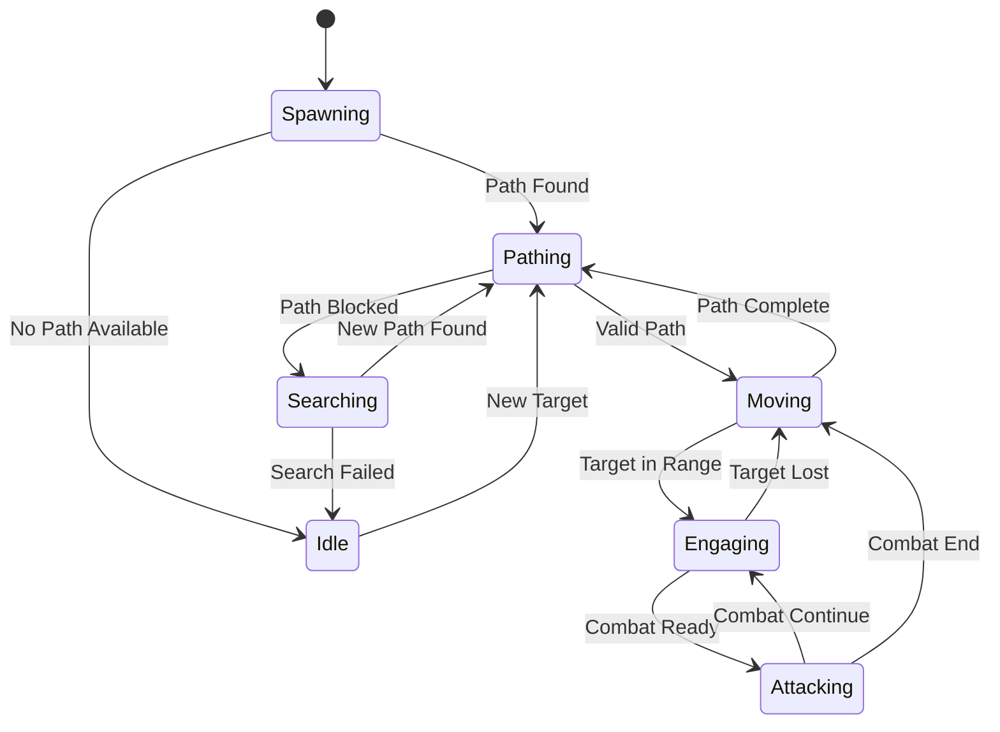
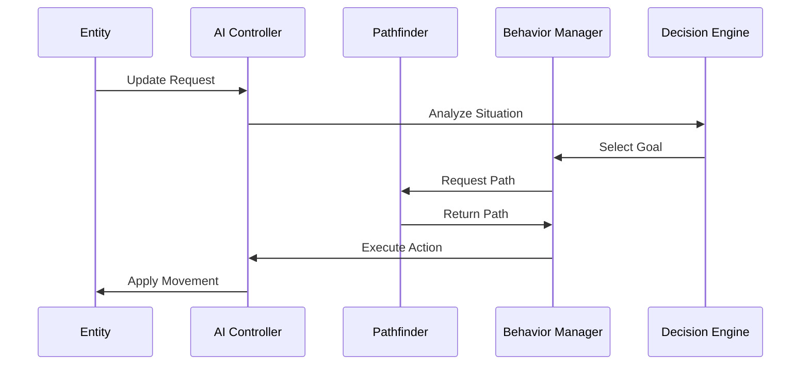

# AI System Architecture

HueHordes implements a sophisticated AI system that combines intelligent pathfinding, dynamic behavior management, and reactive decision-making to create engaging and challenging horde encounters.

## System Overview

The HueHordes AI system is built on three core pillars that work together to create intelligent, adaptive horde behavior.


## Architecture Components

### 1. Pathfinding Engine

The pathfinding system is the foundation of intelligent movement in HueHordes.

#### A* Pathfinder Implementation

**Location**: `AStarPathfinder.cs`

**Core Features**:

- **3D Pathfinding**: Full three-dimensional navigation with Y-axis awareness
- **Entity-Aware Coordinates**: Uses entity base positioning (Y-1=ground, Y=entity base, Y+1=body)
- **Symmetrical Movement**: Balanced ±1 block movement in all directions
- **Dynamic Obstacle Detection**: Real-time path recalculation around obstacles

**Algorithm Details**:

```csharp
public class AStarPathfinder
{
    // Core pathfinding with heuristic optimization
    private double CalculateHeuristic(Vec3i current, Vec3i target)
    {
        // Manhattan distance with 3D awareness
        return Math.Abs(current.X - target.X) + 
               Math.Abs(current.Y - target.Y) + 
               Math.Abs(current.Z - target.Z);
    }

    // Movement validation with entity physics
    private bool IsValidMovement(Vec3i from, Vec3i to, IBlockAccessor blockAccessor)
    {
        // Symmetrical movement constraints
        int deltaX = Math.Abs(to.X - from.X);
        int deltaY = Math.Abs(to.Y - from.Y);  
        int deltaZ = Math.Abs(to.Z - from.Z);
        
        return deltaX <= 1 && deltaY <= 1 && deltaZ <= 1;
    }
}
```

**Performance Optimizations**:

- **Cached Results**: Path caching to avoid redundant calculations
- **Early Termination**: Algorithm stops when optimal path is found
- **Selective Updates**: Only recalculates when environment changes

#### Coordinate System Architecture

The pathfinding uses an entity-aware coordinate system:

| Y Level | Entity Part | Validation |
|---------|-------------|------------|
| **Y+1** | Head/Body Space | Must be passable |
| **Y** | Entity Base | Entity position reference |
| **Y-1** | Ground Block | Must be solid for standing |

This system ensures entities can:

- Walk on solid surfaces
- Navigate through 2-block high spaces
- Avoid getting stuck in walls or ceilings
- Handle stairs and elevation changes

### 2. Behavior Management System

The behavior system controls how entities act and react in different situations.

#### State Machine Architecture



#### Behavior Components

**Goal Selection System**:

- **Primary Goal**: Reach player base
- **Secondary Goals**: Engage nearby threats
- **Fallback Goals**: Random exploration

**Action Execution**:

- **Movement Actions**: Pathfinding-based navigation
- **Combat Actions**: Attack patterns and positioning
- **Utility Actions**: Resource interaction and environment manipulation

### 3. Decision Making Framework

The decision-making system enables dynamic responses to changing conditions.

#### Environment Analysis

**Threat Detection**:

```csharp
public class ThreatAssessment
{
    public enum ThreatLevel
    {
        None,       // No immediate threats
        Low,        // Distant or weak threats  
        Medium,     // Moderate threats requiring attention
        High,       // Immediate danger requiring action
        Critical    // Life-threatening situations
    }

    public ThreatLevel AssessEnvironment(Entity entity)
    {
        // Analyze nearby players, structures, and hazards
        // Return appropriate threat level
    }
}
```

**Environmental Factors**:

- **Player Proximity**: Distance to nearest players
- **Base Detection**: Identification of player structures
- **Terrain Analysis**: Navigation difficulty assessment
- **Resource Availability**: Items and blocks in area

#### Adaptive Response System

The AI adapts its behavior based on:

1. **Success Rates**: Learning from previous pathfinding attempts
2. **Environmental Changes**: Responding to block changes and new obstacles
3. **Player Behavior**: Adapting to player defensive strategies
4. **Group Dynamics**: Coordinating with other horde entities

## Integration Architecture

### System Initialization

```csharp
public class HordeSystemManager
{
    private AStarPathfinder pathfinder;
    private BehaviorManager behaviorManager;
    private DecisionEngine decisionEngine;

    public void Initialize()
    {
        // Initialize core systems
        pathfinder = new AStarPathfinder();
        behaviorManager = new BehaviorManager();
        decisionEngine = new DecisionEngine();
        
        // Wire up event handlers
        pathfinder.OnPathFound += behaviorManager.HandlePathFound;
        behaviorManager.OnGoalChanged += decisionEngine.UpdateGoals;
        decisionEngine.OnDecisionMade += ExecuteAction;
    }
}
```

### Data Flow Architecture



## Performance Considerations

### Computational Optimization

**Pathfinding Performance**:

- **Thread Safety**: Lock-free algorithms where possible
- **Memory Pooling**: Reuse of calculation objects
- **Selective Processing**: Update only active entities

**Update Frequency**:

- **High Priority**: Combat and immediate threats (every tick)
- **Medium Priority**: Pathfinding and navigation (every 5 ticks)
- **Low Priority**: Long-term planning (every 20 ticks)

### Scalability Architecture

**Entity Management**:

```csharp
public class EntityAIManager
{
    private Dictionary<long, AIController> activeControllers;
    private Queue<AIController> updateQueue;
    
    public void ProcessUpdates(int maxUpdatesPerTick)
    {
        // Process limited number of AI updates per game tick
        // Distribute computational load across multiple frames
    }
}
```

**Resource Management**:

- **Memory Limits**: Automatic cleanup of unused AI data
- **CPU Budgeting**: Limited processing time per game tick
- **Cache Management**: Intelligent caching of expensive calculations

## Debugging and Analysis

### Debug Visualization System

**Pathfinding Visualization**:

- **Path Particles**: Visual representation of calculated paths
- **Node Indicators**: Show explored and optimal nodes
- **Status Overlays**: Real-time AI state information

**Performance Monitoring**:

- **Timing Metrics**: Pathfinding calculation times
- **Memory Usage**: AI system memory consumption
- **Success Rates**: Pathfinding and goal achievement statistics

### Debug Commands

| Command | Purpose | Output |
|---------|---------|---------|
| `/horde debug on` | Enable AI debugging | Visual indicators |
| `/testparticles path` | Show pathfinding | Path visualization |
| `/horde analyze` | System analysis | Performance metrics |

## Future Enhancements

### Planned AI Improvements

1. **Machine Learning Integration**: Adaptive behavior based on player patterns
2. **Swarm Intelligence**: Coordinated group behaviors
3. **Dynamic Difficulty**: AI complexity scaling with player skill
4. **Predictive Pathfinding**: Anticipating player movements

### Extensibility Framework

The AI system is designed for easy extension:

```csharp
public interface IAIBehavior
{
    BehaviorResult Execute(AIContext context);
    bool CanExecute(AIContext context);
    int Priority { get; }
}

public class CustomBehavior : IAIBehavior
{
    // Implement custom AI behaviors
    // Integrate with existing system
}
```

## Technical Specifications

### System Requirements

| Component | Requirement | Notes |
|-----------|-------------|--------|
| **CPU** | Multi-core recommended | Pathfinding is CPU-intensive |
| **Memory** | 2GB+ available | For AI data structures |
| **Threading** | Background thread support | Async pathfinding calculations |

### Configuration Parameters

**AI System Settings**:

- `PathfindingTimeout`: Maximum time for path calculations
- `MaxSearchNodes`: Limit pathfinding complexity
- `UpdateFrequency`: AI update interval
- `DebugVisualization`: Enable/disable debug rendering

---

*For implementation details, see the [Pathfinding System Guide](pathfinding-system.md) and [Development Guide](development-guide.md).*
