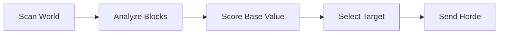

# Base Detection System

The Base Detection System in HueHordes is responsible for identifying player-constructed bases and structures, enabling intelligent horde targeting and strategic gameplay mechanics.

## System Overview

The base detection system analyzes the game world to identify areas that represent player investment and activity. This allows hordes to focus on meaningful targets rather than wandering aimlessly.



## Core Components

### 1. Structure Analysis Engine

The structure analysis engine examines the physical composition of potential bases.

#### Block Type Classification

**Crafted vs Natural Blocks**:

```csharp
public enum BlockClassification
{
    Natural,        // Stone, dirt, naturally generated blocks
    BasicCrafted,   // Simple player-made blocks (cobble, planks)
    Advanced,       // Refined materials (cut stone, metal)
    Functional,     // Interactive blocks (chests, workbenches)
    Decorative,     // Non-functional aesthetic blocks
    Defensive       // Walls, doors, gates
}
```

**Detection Criteria**:

| Block Type | Base Indicator | Weight |
|------------|----------------|---------|
| **Natural Blocks** | Low (unless arranged) | 1x |
| **Crafted Materials** | Medium | 3x |
| **Functional Blocks** | High | 5x |
| **Rare Materials** | Very High | 8x |
| **Defensive Structures** | Maximum | 10x |

#### Pattern Recognition

**Structure Patterns**:

```csharp
public class StructurePattern
{
    public PatternType Type { get; set; }
    public int MinBlockCount { get; set; }
    public double RequiredDensity { get; set; }
    public List<BlockClassification> RequiredBlocks { get; set; }
}

public enum PatternType
{
    Wall,           // Linear defensive structures
    Room,           // Enclosed spaces with floor, walls, ceiling
    Farm,           // Agricultural areas with crops
    Workshop,       // Areas with multiple functional blocks
    Storage,        // Concentrated chest/container areas
    Compound        // Large multi-structure bases
}
```

**Pattern Detection Algorithm**:

1. **Flood Fill Analysis**: Identifies connected crafted block regions
2. **Geometric Analysis**: Detects rectangular, circular, and irregular shapes
3. **Density Calculation**: Measures block concentration in areas
4. **Connectivity Mapping**: Links separate structures into compound bases

### 2. Activity Detection System

The activity detection system identifies recent player interaction and ongoing base development.

#### Player Presence Indicators

**Direct Indicators**:

- Player spawn points and beds
- Recent player positions (tracked over time)
- Light sources (torches, lanterns)
- Active furnaces and workstations

**Indirect Indicators**:

- Recently placed blocks
- Harvested crops or resources
- Modified terrain (mining, excavation)
- Tool usage patterns

#### Change Tracking

```csharp
public class ActivityTracker
{
    private Dictionary<Vec3i, BlockChange> recentChanges;
    private Dictionary<long, PlayerActivity> playerActivities;
    
    public void TrackBlockChange(Vec3i position, Block oldBlock, Block newBlock)
    {
        var change = new BlockChange
        {
            Position = position,
            OldBlock = oldBlock,
            NewBlock = newBlock,
            Timestamp = DateTime.UtcNow,
            ChangeType = ClassifyChange(oldBlock, newBlock)
        };
        
        recentChanges[position] = change;
        UpdateActivityHeatmap(position);
    }
}
```

**Change Classification**:

- **Construction**: Placing crafted blocks
- **Destruction**: Breaking player-made structures  
- **Improvement**: Upgrading materials (cobble → stone)
- **Expansion**: Adding to existing structures
- **Maintenance**: Replacing damaged blocks

### 3. Base Scoring System

The scoring system evaluates detected structures to determine their importance as horde targets.

#### Scoring Factors

**Size and Complexity**:

```csharp
public class BaseScorer
{
    public double CalculateBaseScore(DetectedBase baseData)
    {
        double score = 0;
        
        // Size factor (larger bases are more significant)
        score += baseData.BlockCount * 0.1;
        
        // Complexity factor (variety of block types)
        score += baseData.UniqueBlockTypes * 2.0;
        
        // Functional factor (workstations, storage)
        score += baseData.FunctionalBlocks * 5.0;
        
        // Defensive factor (walls, gates, towers)
        score += baseData.DefensiveStructures * 8.0;
        
        // Activity factor (recent player interaction)
        score += baseData.RecentActivity * 3.0;
        
        // Rarity factor (valuable materials)
        score += baseData.RareMaterials * 10.0;
        
        return Math.Min(score, 1000); // Cap maximum score
    }
}
```

**Scoring Categories**:

| Category | Description | Score Range |
|----------|-------------|-------------|
| **Outpost** | Small, basic structures | 1-50 |
| **Settlement** | Medium complexity bases | 51-200 |
| **Fortress** | Large, well-defended bases | 201-500 |
| **Metropolis** | Massive compound bases | 501-1000 |

#### Priority Calculation

**Target Priority Factors**:

1. **Base Score**: Primary scoring metric
2. **Distance**: Closer bases get priority bonus
3. **Accessibility**: Easier to reach bases preferred
4. **Player Count**: More active players increase priority
5. **Defense Level**: Higher defenses increase challenge value

```csharp
public double CalculatePriority(DetectedBase baseData, Vec3d hordePosition)
{
    double baseScore = CalculateBaseScore(baseData);
    double distance = baseData.Center.DistanceTo(hordePosition);
    double accessibility = CalculateAccessibility(baseData, hordePosition);
    
    // Distance penalty (farther bases less attractive)
    double distanceFactor = Math.Max(0.1, 1.0 - (distance / 500.0));
    
    // Accessibility bonus (easier paths preferred)
    double accessFactor = Math.Max(0.5, accessibility);
    
    return baseScore * distanceFactor * accessFactor;
}
```

### 4. Detection Algorithms

#### Area Scanning

**Chunk-Based Analysis**:

```csharp
public class ChunkAnalyzer
{
    public void AnalyzeChunk(IWorldChunk chunk)
    {
        var blockCounts = new Dictionary<BlockClassification, int>();
        var patterns = new List<StructurePattern>();
        
        // Iterate through all blocks in chunk
        for (int x = 0; x < 32; x++)
        {
            for (int y = 0; y < 256; y++)
            {
                for (int z = 0; z < 32; z++)
                {
                    var block = chunk.GetBlock(x, y, z);
                    var classification = ClassifyBlock(block);
                    blockCounts[classification]++;
                    
                    // Check for structure patterns
                    CheckPatterns(x, y, z, block, patterns);
                }
            }
        }
        
        // Evaluate chunk for base potential
        EvaluateChunk(blockCounts, patterns);
    }
}
```

**Radial Scanning**:

- **Center Point**: Start from player spawn or known bases
- **Expanding Radius**: Search outward in growing circles
- **Selective Depth**: Focus on areas with initial base indicators
- **Performance Optimization**: Skip areas with no crafted blocks

#### Multi-Level Detection

**Level 1 - Quick Scan**:

- Identify chunks with crafted blocks
- Basic pattern recognition
- Minimal computational cost

**Level 2 - Detailed Analysis**:

- Complete structure mapping
- Activity correlation
- Pattern classification

**Level 3 - Deep Evaluation**:

- Complex base relationships
- Historical activity analysis
- Strategic value assessment

## Integration with Horde System

### Target Selection

```csharp
public class TargetSelector
{
    public DetectedBase SelectTarget(List<DetectedBase> availableBases, Vec3d hordePosition)
    {
        // Calculate priorities for all bases
        var prioritizedBases = availableBases
            .Select(b => new { Base = b, Priority = CalculatePriority(b, hordePosition) })
            .OrderByDescending(x => x.Priority)
            .ToList();
        
        // Select highest priority accessible base
        foreach (var entry in prioritizedBases)
        {
            if (IsAccessible(entry.Base, hordePosition))
            {
                return entry.Base;
            }
        }
        
        return null; // No suitable target found
    }
}
```

### Pathfinding Integration

The base detection system works closely with the pathfinding engine:

1. **Target Identification**: Base detection provides destination coordinates
2. **Access Point Analysis**: Identifies optimal approach routes to bases
3. **Obstacle Mapping**: Provides defensive structure information
4. **Dynamic Updates**: Updates pathfinding when base structures change

## Configuration and Tuning

### Detection Parameters

**Sensitivity Settings**:

```json
{
  "BaseDetection": {
    "MinimumBlockCount": 20,
    "RequiredBlockDensity": 0.3,
    "ScanRadius": 100,
    "UpdateFrequency": 300,
    "ActivityTimeWindow": 3600,
    "ScoreThreshold": 25.0
  }
}
```

**Block Weights Configuration**:

```json
{
  "BlockWeights": {
    "Natural": 1.0,
    "BasicCrafted": 3.0,
    "Advanced": 5.0,
    "Functional": 8.0,
    "Defensive": 10.0,
    "Rare": 15.0
  }
}
```

### Performance Optimization

**Caching Strategy**:

- **Result Caching**: Store detection results for reuse
- **Incremental Updates**: Only re-analyze changed areas
- **Background Processing**: Perform scans during low activity periods

**Resource Management**:

```csharp
public class DetectionManager
{
    private readonly Timer scanTimer;
    private readonly LRUCache<Vec3i, DetectionResult> resultCache;
    
    public void ScheduleScan(Vec3i center, int priority)
    {
        // Queue scan based on priority
        // Manage computational resources
        // Balance accuracy vs performance
    }
}
```

## Debug and Visualization

### Debug Commands

| Command | Function | Output |
|---------|----------|---------|
| `/horde detectbase [player] [radius]` | Scan area for base | Base detection results |
| `/horde debug base [player]` | Visualize detected base | Base particle indicators |
| `/horde spawntobase [player] [count]` | Test base targeting | Spawn entities that target base |

### Visual Indicators

**Base Visualization**:

- **Green Particles**: Confirmed base areas
- **Yellow Particles**: Potential base regions
- **Red Particles**: High-priority targets
- **Blue Particles**: Recent activity areas

## Limitations and Considerations

### Current Limitations

1. **Natural Formations**: May occasionally flag natural formations as bases
2. **Underground Bases**: Limited detection of deep underground structures
3. **Distributed Bases**: Difficulty linking separated but related structures
4. **Performance Impact**: Large-scale scans can impact server performance

### Future Improvements

**Enhanced Pattern Recognition**:

- Machine learning integration for better pattern detection
- Historical data analysis for improved accuracy
- Player behavior prediction

**Advanced Activity Tracking**:

- Economic activity monitoring (trading, crafting)
- Social activity detection (multiplayer interaction)
- Defensive activity recognition (combat preparations)

---

*For related systems, see [AI System Architecture](ai-system-architecture.md) and [Pathfinding System Guide](pathfinding-system.md).*
