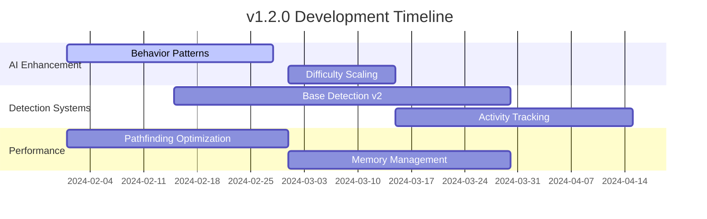
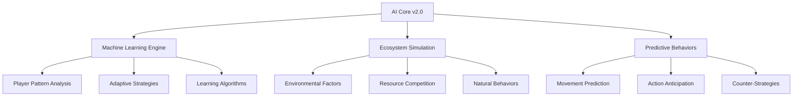
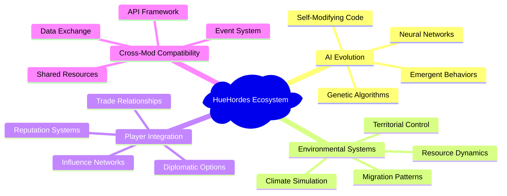
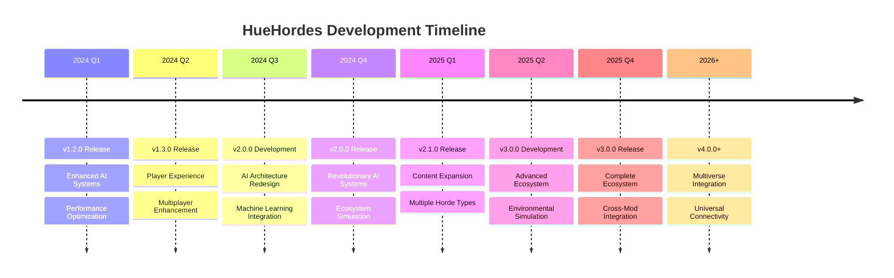

# Future Development Roadmap

This roadmap outlines the planned features, improvements, and long-term vision for HueHordes development. The roadmap is organized by development phases and priority levels.

## Development Philosophy

HueHordes development follows these core principles:

- **Player-Centric Design**: All features should enhance player experience and engagement
- **Performance First**: New features must maintain or improve game performance  
- **Modular Architecture**: Systems should be extensible and maintainable
- **Community Feedback**: Player input drives feature prioritization
- **Vintage Story Integration**: Seamless integration with base game mechanics

## Current Status (v1.0.x)

### ✅ Completed Features

**Core Systems**:

- Basic horde spawning and management
- 3D A* pathfinding with entity-aware coordinates
- Particle-based debug visualization
- Configuration system with JSON settings
- Command-line interface for testing and debugging

**AI Features**:

- Intelligent pathfinding to player bases
- Obstacle avoidance and navigation
- Basic behavior state management
- Symmetrical movement validation

**Infrastructure**:

- Comprehensive documentation system
- Automated build pipeline
- Testing framework
- Performance monitoring tools

### 🔄 Current Development (v1.1.x)

**In Progress**:

- Enhanced base detection algorithms
- Improved AI decision-making systems  
- Performance optimizations for large hordes
- Additional debug and analysis tools

**Planned for Next Release**:

- Advanced behavior patterns
- Configuration GUI interface
- Multiplayer synchronization improvements
- Extended entity customization options

## Short-Term Roadmap (3-6 months)

### Version 1.2.0 - Enhanced AI Systems

**🎯 Primary Goals**:

- Implement advanced AI behavior patterns
- Add dynamic difficulty scaling
- Enhance base detection accuracy
- Improve pathfinding performance

**🔧 Technical Improvements**:



**New Features**:

- **Adaptive AI**: AI that learns from player behavior patterns
- **Swarm Intelligence**: Coordinated group behaviors for horde entities
- **Dynamic Events**: Special horde events triggered by player actions
- **Enhanced Visualization**: Improved debug tools and real-time monitoring

**Performance Targets**:

- 50% reduction in pathfinding calculation time
- 30% decrease in memory usage for large hordes
- Support for 100+ simultaneous entities
- Sub-second response time for base detection

### Version 1.3.0 - Player Experience Focus

**🎯 Primary Goals**:

- Improve player interaction and feedback
- Add comprehensive customization options
- Enhance multiplayer experience
- Implement progression systems

**Player Features**:

- **Horde Difficulty Progression**: Gradual increase in challenge over time
- **Player Statistics**: Detailed tracking of horde encounters and survival
- **Customizable Behaviors**: Player-configurable AI personalities
- **Notification Systems**: In-game alerts for horde activities

**Multiplayer Enhancements**:

- **Synchronized Events**: Coordinated horde attacks across all players
- **Cooperative Challenges**: Special events requiring teamwork
- **Individual Targeting**: AI that considers each player's base separately
- **Load Balancing**: Optimized server performance for multiplayer

## Medium-Term Roadmap (6-12 months)

### Version 2.0.0 - Major System Overhaul

**🎯 Revolutionary Changes**:

- Complete AI architecture redesign
- Machine learning integration
- Advanced ecosystem simulation
- Cross-mod compatibility framework

**🧠 AI Revolution**:



**Machine Learning Features**:

- **Behavioral Analysis**: AI learns from successful and failed strategies
- **Pattern Recognition**: Identification of player building and movement patterns
- **Adaptive Strategies**: Dynamic adjustment of horde tactics based on player behavior
- **Predictive Pathfinding**: Anticipation of player movements and base expansion

**Ecosystem Integration**:

- **Environmental Awareness**: AI considers weather, time of day, and seasons
- **Resource Competition**: Hordes compete with players for resources
- **Natural Behaviors**: Integration with existing animal AI systems
- **Food Chain Dynamics**: Complex predator-prey relationships

### Version 2.1.0 - Content Expansion

**🎯 Content Goals**:

- Multiple horde types with unique behaviors
- Specialized entity roles and abilities
- Dynamic event system
- Quest and objective integration

**Horde Varieties**:

| Horde Type | Behavior | Specialization |
|------------|----------|----------------|
| **Raiders** | Aggressive, direct assault | Combat and destruction |
| **Scouts** | Stealth, reconnaissance | Intelligence gathering |
| **Builders** | Construct siege equipment | Engineering and siege |
| **Swarm** | Overwhelming numbers | Coordination and persistence |
| **Elite** | Advanced tactics | Strategic planning |

**Dynamic Events**:

- **Seasonal Migrations**: Horde movements following natural patterns
- **Territory Disputes**: Conflicts between different horde factions
- **Resource Wars**: Competition for scarce materials
- **Ancient Awakenings**: Rare, powerful entities with unique abilities

## Long-Term Vision (1-2 years)

### Version 3.0.0 - Ecosystem Simulation

**🌍 Vision Statement**:
Create a living, breathing world where hordes are part of a complex ecosystem that reacts dynamically to player actions and environmental changes.

**🔬 Advanced Systems**:



**Revolutionary Features**:

**AI Evolution System**:

- **Neural Network AI**: Deep learning for complex decision-making
- **Genetic Algorithms**: Evolution of successful horde strategies
- **Emergent Behaviors**: Unpredictable but logical AI actions
- **Self-Improvement**: AI that modifies its own behavior patterns

**Environmental Simulation**:

- **Climate Effects**: Weather patterns influence horde behavior
- **Resource Scarcity**: Dynamic resource availability affects AI goals
- **Territorial Systems**: Horde factions control and defend territories
- **Migration Simulation**: Realistic seasonal and behavioral migrations

**Player Relationship Systems**:

- **Reputation Mechanics**: Player actions affect horde faction relationships
- **Diplomatic Options**: Negotiation and alliance possibilities with certain hordes
- **Trade Systems**: Economic interactions with peaceful horde factions
- **Cultural Exchange**: Learning and technology sharing between players and AI

### Version 4.0.0 - Multiverse Integration

**🌌 Ultimate Vision**:
Cross-server, cross-world integration creating a persistent horde multiverse where actions in one world affect others.

**Multiverse Features**:

- **Cross-Server Events**: Coordinated activities across multiple game servers
- **Persistent Lore**: Shared history and mythology across all installations
- **Global Statistics**: Worldwide tracking of player and horde activities
- **Universal Progression**: Character and faction progression that spans worlds

## Technical Roadmap

### Architecture Evolution

**Current Architecture (v1.x)**:

```
Game Server
├── HueHordes Core
├── Pathfinding Engine
├── Behavior System
└── Configuration Manager
```

**Target Architecture (v3.x)**:

```
HueHordes Ecosystem
├── AI Core Engine
│   ├── Neural Network Processor
│   ├── Genetic Algorithm Manager
│   └── Learning Database
├── Environmental Simulator
│   ├── Climate System
│   ├── Resource Manager
│   └── Territory Controller
├── Cross-Mod Interface
│   ├── API Gateway
│   ├── Event Publisher
│   └── Data Exchange
└── Multiverse Connector
    ├── Server Network
    ├── Global Database
    └── Synchronization Manager
```

### Performance Scaling

**Computational Requirements**:

| Version | CPU Usage | Memory Usage | Network | Storage |
|---------|-----------|--------------|---------|---------|
| **v1.x** | Low | 100MB | Local | 50MB |
| **v2.x** | Medium | 500MB | Regional | 200MB |
| **v3.x** | High | 2GB | Global | 1GB |
| **v4.x** | Variable | 4GB+ | Multiverse | 5GB+ |

**Optimization Strategies**:

- **Distributed Computing**: Spread AI calculations across multiple threads/servers
- **Cloud Integration**: Offload complex calculations to cloud services
- **Caching Systems**: Intelligent caching of expensive computations
- **Adaptive Quality**: Dynamic adjustment of AI complexity based on performance

## Community Integration

### Open Source Evolution

**Current Status**: Closed source with open documentation
**Target**: Gradual open-sourcing of non-core components

**Open Source Roadmap**:

1. **Phase 1**: API and interface specifications
2. **Phase 2**: Utility libraries and tools
3. **Phase 3**: Behavior scripting system
4. **Phase 4**: Core AI algorithms (selective)

### Community Features

**Planned Community Systems**:

- **Behavior Marketplace**: User-created AI behaviors
- **Scenario Sharing**: Custom horde events and challenges
- **Mod Integration**: Seamless integration with other popular mods
- **Community Challenges**: Server-wide events and competitions

### Developer Tools

**Planned Development Tools**:

- **Visual Behavior Editor**: GUI for creating custom AI behaviors
- **Scenario Designer**: Tool for creating complex horde events
- **Performance Profiler**: Real-time analysis of AI performance
- **Debug Visualizer**: Advanced 3D visualization of AI decision-making

## Research Areas

### Experimental Features

**Current Research**:

- **Quantum Computing Integration**: Exploring quantum algorithms for pathfinding
- **Blockchain Persistence**: Decentralized storage of horde evolution data
- **VR Integration**: Virtual reality interfaces for horde observation
- **Procedural Behavior Generation**: AI that creates new behaviors automatically

**Future Research Directions**:

- **Consciousness Simulation**: Exploring true AI consciousness in game entities
- **Emotional Intelligence**: AI with emotional responses and memory
- **Creative Problem Solving**: AI that invents new strategies and tools
- **Player Psychology**: Deep analysis of player behavior and preferences

## Implementation Timeline

### Development Phases



### Milestone Dependencies

**Critical Dependencies**:

- **Vintage Story API Stability**: Core game updates affecting mod compatibility
- **Performance Requirements**: Hardware and server capabilities
- **Community Feedback**: Player responses to new features
- **Technical Feasibility**: Research outcomes and implementation challenges

## Risk Assessment

### Technical Risks

| Risk | Probability | Impact | Mitigation |
|------|-------------|--------|------------|
| **Performance Degradation** | Medium | High | Extensive testing, performance monitoring |
| **Compatibility Issues** | Low | High | Careful API usage, version testing |
| **Complexity Creep** | High | Medium | Modular design, feature prioritization |
| **Resource Limitations** | Medium | Medium | Efficient algorithms, optimization focus |

### Market Risks

| Risk | Probability | Impact | Mitigation |
|------|-------------|--------|------------|
| **Player Interest Decline** | Low | High | Regular content updates, community engagement |
| **Competing Mods** | Medium | Medium | Unique features, quality focus |
| **Game Engine Changes** | Low | High | Flexible architecture, adaptation planning |

## Success Metrics

### Key Performance Indicators

**Technical Metrics**:

- **Performance**: Frame rate impact <5%, memory usage optimization
- **Stability**: Zero critical bugs, 99%+ uptime
- **Compatibility**: Support for all major VS versions and popular mods

**Player Engagement Metrics**:

- **Adoption Rate**: Downloads and active installations
- **Retention**: Continued usage over time periods
- **Satisfaction**: Community feedback and ratings
- **Innovation**: Unique features not found in competing mods

**Development Metrics**:

- **Release Cadence**: Regular, predictable update schedule
- **Code Quality**: Maintainable, well-documented codebase
- **Community Contribution**: Developer participation and contribution rates

---

*This roadmap is subject to change based on community feedback, technical discoveries, and development constraints. For the most current status, check the [GitHub repository](https://github.com/HueByte/VintageHue) and [development blog](https://github.com/HueByte/VintageHue/discussions).*
