# Installation Guide

This guide covers everything you need to know about installing and setting up HueHordes for Vintage Story.

## System Requirements

### Minimum Requirements

| Component | Requirement | Notes |
|-----------|-------------|--------|
| **Vintage Story** | Version 1.21.1+ | Base game required |
| **Operating System** | Windows 10+, Linux, macOS | Cross-platform support |
| **Memory** | 4GB RAM available | For mod and game operation |
| **Storage** | 50MB free space | For mod files and logs |

### Recommended Requirements

| Component | Recommendation | Benefits |
|-----------|----------------|----------|
| **Vintage Story** | Latest stable version | Best compatibility and performance |
| **Memory** | 8GB+ RAM | Smooth operation with larger hordes |
| **CPU** | Multi-core processor | Better pathfinding performance |

## Installation Methods

```mermaid
flowchart TD
    Start(["🚀 Start Installation"])
    
    subgraph "Installation Options"
        Browser["📦 Mod Browser<br/>(Recommended)"]
        Manual["💾 Manual Installation"]
        Source["🛠️ Build from Source"]
    end
    
    subgraph "Mod Browser Process"
        LaunchGame["▶️ Launch Vintage Story"]
        OpenMods["📋 Open Mod Manager"]
        Search["🔍 Search 'HueHordes'"]
        Download["⬇️ Download & Install"]
        RestartBrowser["🔄 Restart Game"]
    end
    
    subgraph "Manual Process"
        GetRelease["📁 Download Release"]
        FindMods["📂 Locate Mods Folder"]
        CopyFiles["📋 Copy Files"]
        RestartManual["🔄 Restart Game"]
    end
    
    subgraph "Source Process"
        Clone["📥 Clone Repository"]
        Build["🔧 Build Project"]
        CopySource["📋 Copy to Mods"]
        RestartSource["🔄 Restart Game"]
    end
    
    subgraph "Verification"
        CheckMods["✅ Check Mod List"]
        TestCommands["🎮 Test Commands"]
        ConfigCheck["⚙️ Check Config"]
    end
    
    Success(["🎉 Installation Complete"])
    
    Start --> Browser
    Start --> Manual
    Start --> Source
    
    Browser --> LaunchGame
    LaunchGame --> OpenMods
    OpenMods --> Search
    Search --> Download
    Download --> RestartBrowser
    
    Manual --> GetRelease
    GetRelease --> FindMods
    FindMods --> CopyFiles
    CopyFiles --> RestartManual
    
    Source --> Clone
    Clone --> Build
    Build --> CopySource
    CopySource --> RestartSource
    
    RestartBrowser --> CheckMods
    RestartManual --> CheckMods
    RestartSource --> CheckMods
    
    CheckMods --> TestCommands
    TestCommands --> ConfigCheck
    ConfigCheck --> Success
```



### Method 1: Mod Browser (Recommended)

1. **Launch Vintage Story**
2. **Open Mod Manager**:
   - Click "Mods" in the main menu
   - Select "Browse & Download Mods"
3. **Search for HueHordes**:
   - Type "HueHordes" in the search box
   - Click on the HueHordes mod entry
4. **Install the Mod**:
   - Click "Download & Install"
   - Wait for download to complete
   - Restart Vintage Story when prompted

### Method 2: Manual Installation

#### Download Release

1. **Get the Latest Release**:
   - Visit [GitHub Releases](https://github.com/HueByte/VintageHue/releases)
   - Download the latest `HueHordes-vX.X.X.zip` file
   - Extract the ZIP archive

2. **Locate Mods Directory**:

| Platform | Mods Directory Path |
|----------|---------------------|
| 🪟 **Windows** | `%APPDATA%\VintageStory\Mods\` |
| 🐧 **Linux** | `~/.config/VintageStory/Mods/` |
| 🍎 **macOS** | `~/Library/Application Support/VintageStory/Mods/` |

3. **Install Mod Files**:
   - Copy `HueHordes.dll` to your Mods directory
   - Ensure the file is not in a subfolder
   - Restart Vintage Story

#### Build from Source

For developers and advanced users:

```bash
# Clone the repository
git clone https://github.com/HueByte/VintageHue.git
cd VintageHue/src/HueHordes/HueHordes

# Build the project
dotnet build --configuration Release

# Copy to mods directory
cp bin/Release/Mods/mod/HueHordes.dll [YOUR_MODS_DIRECTORY]/
```

## Installation Verification

### Check Mod Loading

1. **Launch Vintage Story**
2. **Open Mod Manager**:
   - Click "Mods" in main menu
   - Select "Manage Installed Mods"
3. **Verify HueHordes**:
   - Look for "HueHordes" in the list
   - Ensure status shows "Loaded" (green)
   - Check version matches downloaded version

### Test Basic Functionality

#### Server-Side Testing (Single Player or Server Admin)

```bash
# Test configuration loading
# Check server logs for: "HueHordes: Mod system starting"

# Test commands (requires admin privileges)
/horde spawn          # Test entity spawning
/horde detectbase     # Test base detection
/horde spawntobase    # Spawn entities targeting base
/horde debug base     # Test debug system
```

#### Client-Side Verification

- **No Error Messages**: Game should load without HueHordes-related errors
- **Performance**: No significant FPS drops or lag
- **Compatibility**: Other mods should continue working normally

## Configuration Setup

### Initial Configuration

HueHordes automatically creates a configuration file on first run:

**Location**: `[VS_DATA]/ModConfig/Horde.server.json`

**Default Configuration**:

```json
{
  "DaysBetweenHordes": 3,
  "Count": 8,
  "SpawnRadiusMin": 12.0,
  "SpawnRadiusMax": 24.0,
  "EntityCodes": ["drifter-normal"],
  "NudgeTowardInitialPos": true,
  "NudgeSeconds": 20.0,
  "NudgeSpeed": 0.05,
  "EnableDebugLogging": false,
  "DebugLoggingLevel": 1
}
```

### Recommended First-Time Settings

For new installations, consider these adjustments:

```json
{
  "DaysBetweenHordes": 7,        // Longer intervals for learning
  "Count": 5,                    // Smaller hordes initially
  "EnableDebugLogging": true,    // Enable for troubleshooting
  "DebugLoggingLevel": 2         // Detailed logging
}
```

## Troubleshooting Installation

### Troubleshooting Flowchart

```mermaid
flowchart TD
    Start([🔧 Installation Problem])
    
    ModVisible{Mod Visible in<br/>Mod Manager?}
    ModLoaded{Mod Status<br/>Shows 'Loaded'?}
    CommandWork{Commands<br/>Work?}
    Performance{Performance<br/>Issues?}
    
    %% File Issues
    CheckFile[📁 Check File Location<br/>• DLL in Mods folder<br/>• Not in subfolder]
    CheckVersion[🔍 Check Game Version<br/>• VS 1.21.1+<br/>• Compatible version]
    RedownloadMod[⬇️ Re-download Mod<br/>• Check file integrity<br/>• Use official source]
    
    %% Loading Issues  
    CheckLogs[📋 Check Logs<br/>• server-main.txt<br/>• Look for errors]
    CheckDeps[🔗 Check Dependencies<br/>• VS API version<br/>• Conflicting mods]
    ResetConfig[⚙️ Reset Config<br/>• Delete config file<br/>• Let mod recreate]
    
    %% Performance Issues
    DisableDebug[🐛 Disable Debug<br/>• Set EnableDebugLogging: false<br/>• Reduce logging level]
    ReduceHordes[📉 Reduce Load<br/>• Lower horde count<br/>• Increase intervals]
    CheckResources[💻 Check Resources<br/>• Monitor RAM/CPU<br/>• Close other apps]
    
    Success([✅ Problem Solved])
    GetHelp[🆘 Get Help<br/>• GitHub Issues<br/>• Community Support<br/>• Include logs]
    
    Start --> ModVisible
    
    ModVisible -->|No| CheckFile
    CheckFile --> CheckVersion
    CheckVersion --> RedownloadMod
    RedownloadMod --> ModVisible
    
    ModVisible -->|Yes| ModLoaded
    ModLoaded -->|No| CheckLogs
    CheckLogs --> CheckDeps
    CheckDeps --> ResetConfig
    ResetConfig --> ModLoaded
    
    ModLoaded -->|Yes| CommandWork
    CommandWork -->|No| CheckLogs
    
    CommandWork -->|Yes| Performance
    Performance -->|Yes| DisableDebug
    DisableDebug --> ReduceHordes
    ReduceHordes --> CheckResources
    CheckResources --> Success
    
    Performance -->|No| Success
    
    %% Failed paths
    RedownloadMod -.->|Still Failed| GetHelp
    ResetConfig -.->|Still Failed| GetHelp
    CheckResources -.->|Still Failed| GetHelp
```



### Common Issues

#### Mod Not Loading

**Symptoms**: HueHordes not visible in mod list

**Solutions**:

1. **Check file location**: Ensure `HueHordes.dll` is directly in Mods folder
2. **Verify game version**: Confirm Vintage Story 1.21.1+
3. **Check file integrity**: Re-download if file is corrupted
4. **Review logs**: Check `Logs/server-main.txt` for errors

#### Configuration Errors

**Symptoms**: Mod loads but doesn't function properly

**Solutions**:

1. **Delete config file**: Let HueHordes recreate defaults
2. **Check JSON syntax**: Validate configuration format
3. **Reset to defaults**: Use minimal configuration first

#### Performance Issues

**Symptoms**: Game lag or low FPS after installation

**Solutions**:

1. **Disable debug logging**: Set `EnableDebugLogging: false`
2. **Reduce horde size**: Lower `Count` value
3. **Increase intervals**: Higher `DaysBetweenHordes`
4. **Check system resources**: Monitor RAM and CPU usage

#### Compatibility Problems

**Symptoms**: Other mods stop working or conflicts occur

**Solutions**:

1. **Test mod isolation**: Disable other mods temporarily
2. **Check mod versions**: Ensure all mods support VS 1.21.1+
3. **Review load order**: Some mods may conflict with HueHordes
4. **Report issues**: Submit bug report with mod list

### Getting Help

#### Log Collection

When reporting issues, include:

1. **Server Logs**: `Logs/server-main.txt`
2. **Client Logs**: `Logs/client-main.txt`
3. **Configuration**: Your `Horde.server.json` file
4. **Mod List**: All installed mods and versions

#### Support Channels

- **GitHub Issues**: [Report bugs and feature requests](https://github.com/HueByte/VintageHue/issues)
- **Documentation**: Check articles for detailed guides
- **Community**: Vintage Story modding communities

## Next Steps

After successful installation:

1. **[Configuration Guide](configuration-guide.md)** - Customize mod behavior
2. **[AI System Architecture](ai-system-architecture.md)** - Understand how the AI works
3. **[Base Detection System](base-detection-system.md)** - Learn about base detection mechanics
4. **[Troubleshooting Guide](troubleshooting-guide.md)** - Solve common problems

## Advanced Installation

### Server Installation

For dedicated servers:

1. **Install on Server**: Place `HueHordes.dll` in server's Mods directory
2. **Configure Settings**: Adjust `Horde.server.json` for server environment
3. **Admin Commands**: Test commands with server admin privileges
4. **Client Compatibility**: Clients don't need the mod installed

### Development Setup

For mod development and testing:

1. **Development Environment**: Set up .NET 8.0 SDK
2. **Source Code**: Clone repository for full source access
3. **Debug Mode**: Enable comprehensive logging
4. **Testing Tools**: Use particle debug commands for development

---

*Need help? Check the [Troubleshooting Guide](troubleshooting-guide.md) or visit our [GitHub Issues](https://github.com/HueByte/VintageHue/issues) page.*
