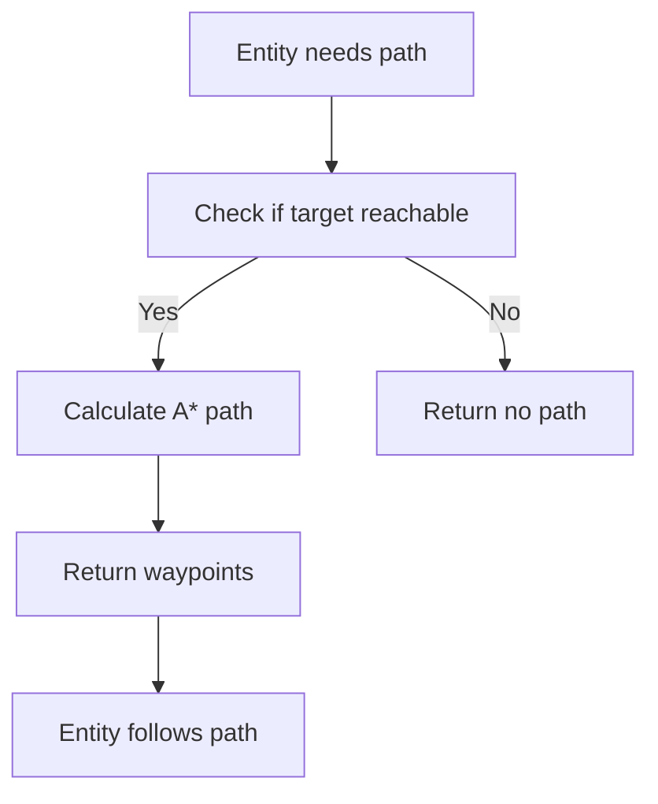

# Advanced Pathfinding System

HueHordes features a sophisticated 3D A* pathfinding system designed specifically for Vintage Story's blocky terrain. The system provides realistic entity movement with intelligent obstacle avoidance and terrain navigation.

## Coordinate System

### Entity-Based Coordinates

The pathfinding system validates three Y levels for each position:

```
Y-1: Ground block (must be solid for entity to stand on)
Y:   Entity base level (must be passable for entity body)  
Y+1: Entity head clearance (must be passable for entity head)
```

### Coordinate Conversion

Entity world positions are automatically converted to base-level coordinates:

- Entity at Y=3.4 → Entity base Y=3 (rounded down)
- Entity at Y=5.0 → Entity base Y=5
- Pathfinding operates on integer coordinates for precise block-based movement

## How Pathfinding Works



## Movement System

### Symmetrical Movement

The pathfinding enforces **±1 block vertical movement** for realistic navigation:

#### Upward Movement (Jumping)

- Entity can jump from base level Y to Y+1
- Requires solid ground at destination Y-1
- Additional jump cost penalty applied to A* algorithm

#### Downward Movement (Walking)

- Entity can walk down from base level Y to Y-1  
- No jumping required, natural stepping down
- Same movement cost as upward movement for algorithm balance

### Movement Validation

For each potential move, the system validates:

1. **Ground Check (Y-1)**: Must be solid block for entity to stand on
2. **Base Clearance (Y)**: Must be clear air for entity base/bottom
3. **Body Clearance (Y+1)**: Must be clear air for entity body/top

### Diagonal Movement Protection

Special validation prevents corner-cutting through solid blocks:

```csharp
// For diagonal moves, check intermediate positions
var intermediatePos1 = new Vec3i(from.X, from.Y, to.Z);
var intermediatePos2 = new Vec3i(to.X, from.Y, from.Z);

// Both intermediate positions must be walkable
return IsPositionWalkable(intermediatePos1) && IsPositionWalkable(intermediatePos2);
```

## Algorithm Features

### A* Implementation

- **Heuristic**: Manhattan distance for accurate 3D pathfinding
- **Cost Function**: Horizontal (1.0), Vertical (1.4), Diagonal (1.4), Jump penalty (2.0)
- **Open/Closed Sets**: Efficient node management with priority queue
- **Maximum Nodes**: Configurable search limit (default: 1000 nodes)

### Performance Optimizations

- **Integer Coordinates**: Fast coordinate operations without floating-point overhead
- **Early Termination**: Stops search when maximum nodes reached
- **Stuck Detection**: Automatic fallback to nearest accessible position
- **Memory Management**: Reusable data structures for multiple pathfinding calls

## Visual Debugging

### Particle System Integration

The pathfinding system includes built-in visualization:

- **Path Particles**: Real-time display of calculated routes
- **Coordinate Logging**: Detailed debug output for each waypoint
- **Entity Tracking**: Unique particle colors per entity
- **Performance Monitoring**: Path calculation timing and node statistics

### Debug Commands

```bash
# Show base detection with particles
/horde debug base

# Show pathfinding visualization  
/horde debug paths

# Clear all debug particles
/horde debug clear
```

### Log Output Examples

```log
[AStar/PathCoordinates] Entity mob_123: START(100.0,2.0,200.0) -> END(150.0,3.0,250.0)
Path length: 23 waypoints

[Particles/ParticleSpawned] Particle #1 at entity base (100,2,200) -> world pos (100.5,2.0,200.5)
[Particles/ParticleSpawned] Particle #2 at entity base (101,2,201) -> world pos (101.5,2.0,201.5)

[Particles/PathComplete] Complete path: (100,2,200) -> (101,2,201) -> (150,3,250)
Entity mob_123: 23 nodes, 23 particles spawned
```

## Integration with AI System

### Entity Behavior

1. **Path Calculation**: AI calls `FindPath(start, end, entityId)`
2. **Route Following**: Entity follows waypoints in sequence
3. **Obstacle Handling**: Dynamic recalculation when blocked
4. **State Management**: Clean integration with AI state machine

### Base Detection Integration

- **Target Validation**: Ensures bases are reachable before pathfinding
- **Height Adjustment**: Automatically finds accessible positions near targets
- **Multi-level Bases**: Handles complex base structures with proper navigation

## Configuration

### Pathfinding Parameters

| Parameter | Default | Description |
|-----------|---------|-------------|
| `MAX_JUMP_HEIGHT` | 1 | Maximum blocks entity can jump up |
| `MAX_FALL_HEIGHT` | 10 | Maximum blocks entity can safely fall |
| `MOVE_COST_HORIZONTAL` | 1.0 | Cost for horizontal movement |
| `MOVE_COST_VERTICAL` | 1.4 | Cost for vertical movement |
| `MOVE_COST_DIAGONAL` | 1.4 | Cost for diagonal movement |
| `JUMP_COST_PENALTY` | 2.0 | Additional cost for jumping |

### Performance Tuning

```csharp
// Adjust maximum nodes for performance vs. accuracy
public List<Vec3d> FindPath(Vec3d start, Vec3d end, string entityId, int maxNodes = 1000)

// Enable/disable visualization for production
var pathfinder = new AStarPathfinder(serverApi, enablePathVisualization: false);
```

## Best Practices

### For Modders

1. **Use Entity IDs**: Always provide unique entity identifiers for debugging
2. **Handle Failed Paths**: Check for empty results and implement fallbacks
3. **Cache Results**: Store paths for entities to reduce computation
4. **Monitor Performance**: Watch node count and calculation time in logs

### For Server Operators

1. **Debug Mode**: Enable visualization only during development/testing
2. **Performance Monitoring**: Watch for excessive pathfinding calls
3. **Memory Usage**: Monitor entity count and active paths
4. **Log Analysis**: Use coordinate logging to debug movement issues

## Troubleshooting

### Common Issues

| Issue | Cause | Solution |
|-------|-------|---------|
| No path found | Unreachable target | Check for blocks between start/end |
| Entities stuck | Invalid terrain | Verify ground blocks and clearance |
| Performance lag | Too many pathfinding calls | Reduce entity count or cache paths |
| Incorrect particles | Coordinate mismatch | Verify Y-coordinate system usage |

### Debug Logging

Enable detailed pathfinding logs in `ModConfig/Horde.server.json`:

```json
{
  "EnableDebugLogging": true,
  "DebugLoggingLevel": 2
}
```

This will output comprehensive pathfinding information for analysis and troubleshooting.
